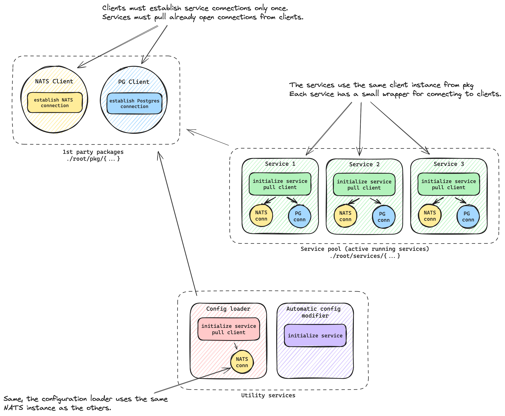
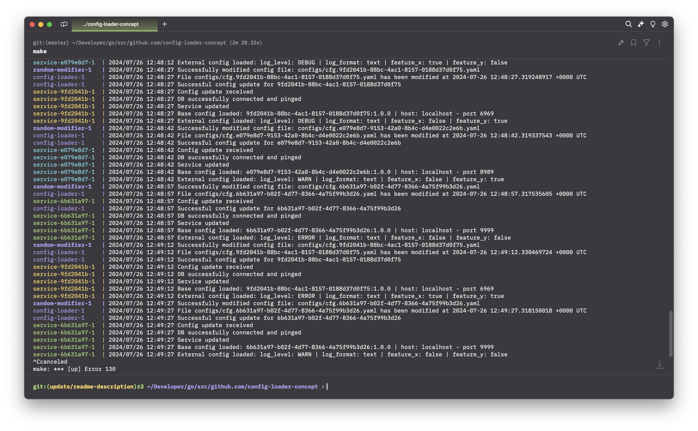

## Config loader concept architecture for GoLang services

This is a monorepository project that demonstrates a working concept of an architecture with services capable of hot-swapping included configurations.

### Overview
This project aims to implement a dynamic configuration management system for a set of independent services. Each service has its own configuration file, which can be updated and hot-swapped without manual intervention. The system leverages NATS for messaging and JetStream Key-Value (KV) store for configuration storage and distribution.

To achieve the automated configuration update process, I have designed a system where the config-loader service acts as a centralized configuration distributor using NATS as the messaging system.
___

### Key Components
*	**Config-Loader Service**
    - Responsible for detecting changes in configuration files and updating the corresponding entries in the NATS KV store.
    - Uses a file watcher mechanism to monitor changes and send updates to the appropriate services via NATS.
* **Independent Services (Service1, Service2, Service3)**
    - Each service subscribes to updates from the NATS KV store.
    - Implements a mechanism to dynamically reload configuration settings upon receiving updates.
    - The services are designed to handle configuration changes without restarting, ensuring minimal downtime and seamless updates.
* **NATS Server**
    - A lightweight, high-performance messaging system used for communication between services.
    - Provides a Pub/Sub model where the Config-Loader service acts as the publisher and the independent services act as subscribers.
* **JetStream Key-Value (KV) Store**
    - An extension of NATS providing a distributed key-value store.
    - Stores configuration data for each service.
    - Supports watching keys for changes, allowing services to react to configuration updates in real-time.

### Configuration Reload Mechanism
- **File Watching:** The Config-Loader service employs a file watcher mechanism to monitor configuration files for changes. When a change is detected, the updated configuration is pushed to the NATS KV store.
- **Dynamic Reload:** Independent services subscribe to their respective configuration keys in the NATS KV store. Upon receiving an update, the service dynamically reloads the configuration, updating its internal settings without restarting.
- **Ensuring Consistency:** The system ensures that only the latest configuration is applied. In case a service is temporarily down, it will retrieve the most recent configuration from the KV store upon restarting.
___

### Why NATS and JetStream KV Store?
The use of NATS JetStream KV store in this project ensures efficient and reliable configuration management, even when services go offline. In a standard NATS setup without JetStream, messages sent to a subject without active subscribers are lost. However, with NATS JetStream, messages sent to a JetStream-enabled subject are stored in a stream, allowing future subscribers to retrieve these messages based on the stream’s retention policy.

Applying this to configuration management, when the Config-Loader updates the configurations, they are sent to the KV store. If a subscriber service is offline, it won’t accumulate outdated configuration updates as there are no queues for offline services. Instead, the KV store ensures that only the latest configuration is available. When the service comes back online, it fetches the current configuration directly from the KV store, guaranteeing it always starts with the most recent settings. This approach not only ensures real-time updates and efficient communication but also provides a robust and fault-tolerant system for maintaining up-to-date configurations across all services without manual intervention.
___

### High Level Architecture


### Low Level Architecture

___
### Basic implementation
**Config Loader Service:** The config-loader service monitors configuration files for changes and updates the NATS JetStream KV store with the new configurations.
```go
nc, _ := nats.Connect(nats.DefaultURL)
js, _ := nc.JetStream()
kv, _ := js.KeyValue("configs")

// Simulate updating the configuration in the KV store
kv.Put("service1", []byte("new config data"))
fmt.Println("Configuration updated in KV store")
```

**Service Subscribers:** Each service subscribes to the relevant configuration key in the NATS JetStream KV store and applies updates in real-time.
```go
nc, _ := nats.Connect(nats.DefaultURL)
js, _ := nc.JetStream()
kv, _ := js.KeyValue("configs")

watch, _ := kv.Watch("service1")
for update := range watch.Updates() {
    if update != nil {
        fmt.Printf("Received updated config: %s\n", string(update.Value()))
        // Apply the new configuration here
    }
}
```
**Docker Setup:** The Docker setup for the services and NATS includes configuration for PostgreSQL instances and the NATS server.
```yaml
version: '3.8'

services:
  nats:
    image: nats
    ports:
      - "4222:4222"

  config-loader:
    build:
      context: .
      dockerfile: config-loader/Dockerfile
    environment:
      - NATS_URL=nats://nats:4222

  service1:
    build:
      context: .
      dockerfile: servicepool/service1/Dockerfile
    environment:
      - NATS_URL=nats://nats:4222

  # Add other services similarly...
```
___
### Package structure

___
### Run services
Makefile for managing Docker containers

```bash
make          # Build and start all services
make build    # Build all Docker images
make up       # Start all services
make down     # Stop all services
make clean    # Stop services and remove containers, networks, volumes, and images
make logs     # Tail logs for all services
make restart  # Restart all services
make help     # Display this help message
```

### Demo


___
### Conclusion

By leveraging NATS JetStream KV store for real-time configuration updates, this dynamic configuration management system ensures seamless and efficient application of changes across all services. The use of NATS JetStream KV store guarantees that only the latest configurations are applied, even if services experience temporary downtime. This approach provides a robust, scalable, and low-latency solution, significantly reducing operational complexity and minimizing potential downtime.
