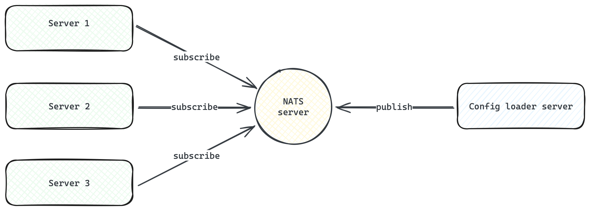
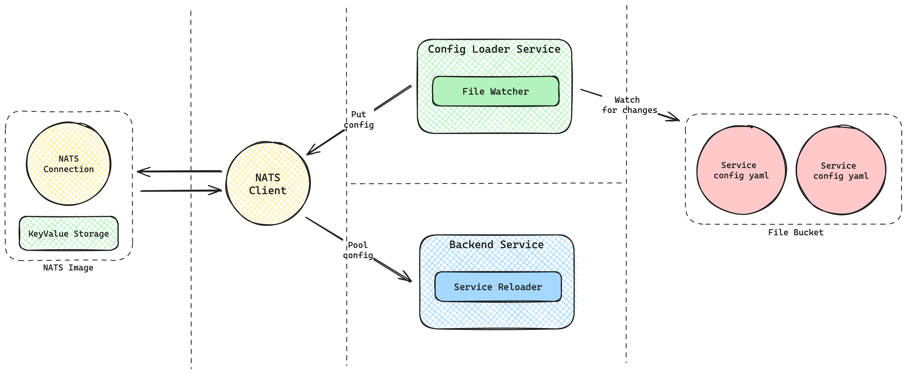

## Config loader concept architecture for GoLang services

This is a monorepository project that demonstrates a working concept of an architecture with services capable of hot-swapping included configurations.
___
To achieve the automated configuration update process, I have designed a system where the config-loader service acts as a centralized configuration distributor using NATS as the messaging system. Here’s a step-by-step outline of the architecture:

* **Config-Loader Service**:
  - Acts as the producer.
  - Reads configuration files.
  - Publishes configuration updates to NATS subjects.
* **Service Subscribers**:
  - Act as consumers.
  - Subscribe to specific NATS subjects to receive their respective configuration updates.
  - Implement hot-swap logic to apply the new configuration without restarting.
___
### High Level Architecture


### Low Level Architecture

___
### Basic implementation
* **Config-Loader Service**:
  - Reads YAML configuration files.
  - Publishes configuration updates to NATS subjects, e.g., config.service1, config.service2, etc.
* **Service Subscribers**:
  - Subscribe to their specific NATS subject to receive configuration updates.
  - Implement logic to apply the new configuration without restarting.
___
### Project directory scheme
```
root/
├── configloader
├── configs/
│   ├── cfg.service1.yaml
│   ├── cfg.service2.yaml
│   └── cfg.service3.yaml
├── servicepool/
│   ├── service1/
│   │   └── config/
│   │       └── cfg.base.yaml
│   ├── service2/
│   │   └── config/
│   │       └── cfg.base.yaml
│   └── service3/
│       └── config/
│           └── cfg.base.yaml
├── configmodifier
├── docker-compose.yaml
└── Makefile
```

### Directory and File Descriptions
* **configloader/**: Contains the source code and related files for the config-loader service, responsible for distributing updated configuration files to other services.
* **configs/**: Stores the centralized configuration files that are managed and distributed by the config-loader service. Each YAML file corresponds to a different service:
  - cfg.service1.yaml: Configuration for service1
  - cfg.service2.yaml: Configuration for service2
  - cfg.service3.yaml: Configuration for service3
* **servicepool/**: Contains directories for each service with their initial base configurations:
  - **service1/**:
    - config/: Contains the base configuration file (cfg.base.yaml) for service1.
  - **service2/**:
    - config/: Contains the base configuration file (cfg.base.yaml) for service2.
  - **service3/**:
    - config/: Contains the base configuration file (cfg.base.yaml) for service3.
* **configmodifier/**: A service that modifies YAML configuration files on a random schedule

___
### Run services
Makefile for managing Docker containers

```bash
make          # Build and start all services
make build    # Build all Docker images
make up       # Start all services
make down     # Stop all services
make clean    # Stop services and remove containers, networks, volumes, and images
make logs     # Tail logs for all services
make restart  # Restart all services
make help     # Display this help message
```
